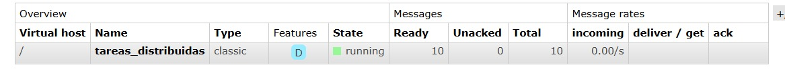

# Taller Clase Rabbit
## Participantes
David Fernando Cifuente Bohorquez - 202221101
Alec Fabian Corzo Salazar - 202220646

### Desarrollo
Una vez creamos el producer y el worker levantamos el contenedor y lo testeamos 

Ahora levantamos dos workers en terminales diferentes para ver cómo las tareas se reparten equitativamente entre los workers.
Si un worker se cae mientras procesa una tarea (sin enviar ack), RabbitMQ reasignará esa tarea al otro worker.

#### Explicación del flujo del sistema
El sistema desarrollado implementa un modelo de Productor, Cola y Consumidor utilizando RabbitMQ como intermediario de mensajería. 
El productor envía las tareas a una cola donde se almacenan temporalmente hasta que los workers las procesan así garantizamos la fiabilidad, utilizamos la persistencia de mensajes y ACK tras completar cada tarea, para que se evite la pérdida de información ante una caida. 
El parametro prefetch=1 permite una distribución equilibrada de las tareas, asegurando que cada worker reciba una sola tarea a la vez. 
